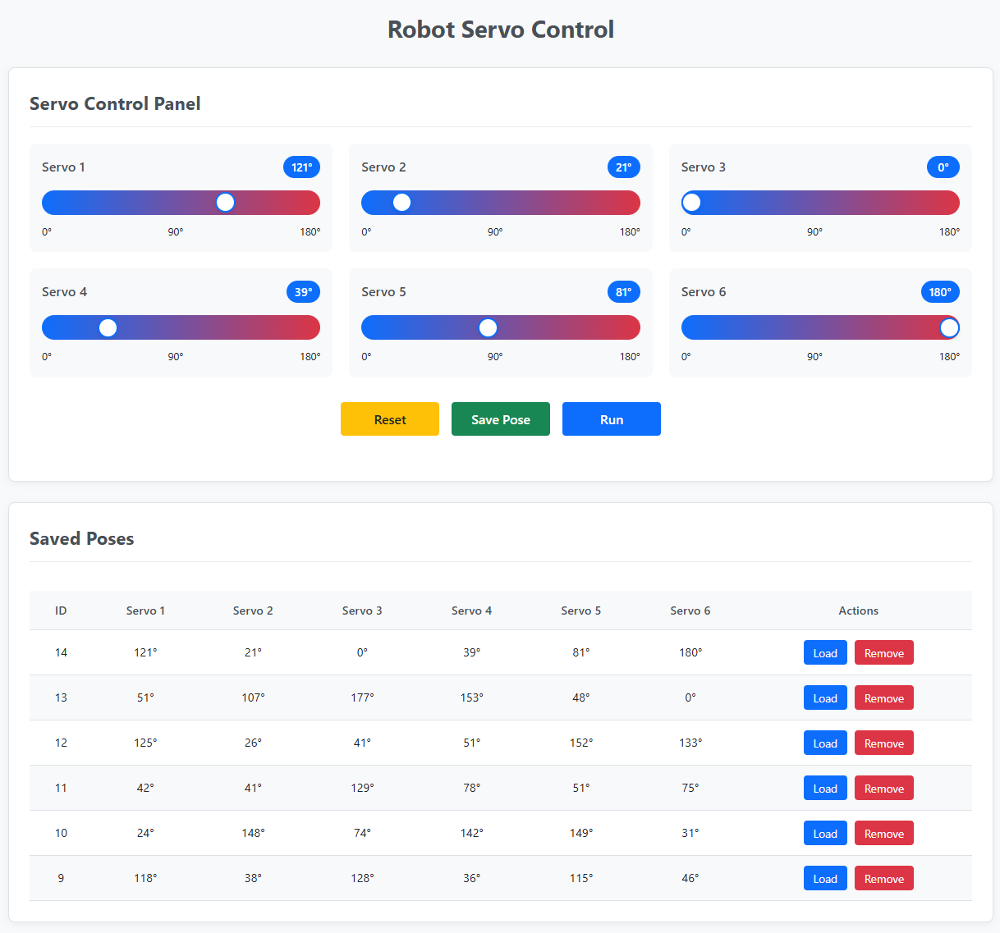
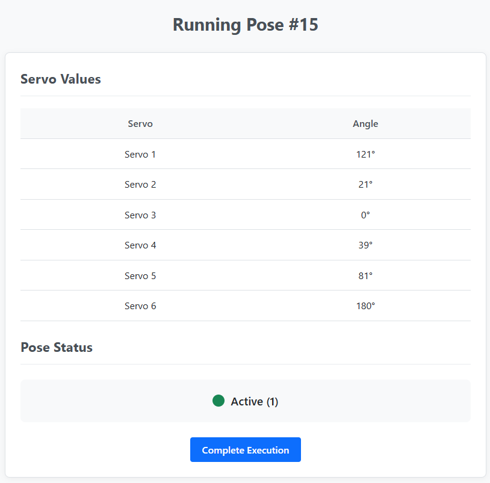

# 🤖 Robot Servo Control Web App

This is a simple robot servo control web application built using **HTML, CSS, JavaScript, PHP, and MySQL (via XAMPP)**. It allows you to control 6 servo motors using sliders, save and load poses, and view servo statuses.

## ⚙️ Features

- Control **6 servo motors** using slider bars (0–180 degrees).
- Default servo position is **90 degrees**.
- **Reset** button to reset all servos to default.
- **Save Pose** button to store current servo angles in the MySQL database.
- **Run** button to view current servo values and their status in a separate page (`get_run_pose.php`).
- Saved poses are displayed below the control panel with:
  - **Load** button to apply pose values back to the sliders.
  - **Remove** button to delete the pose from the database.
- A secondary page `update_status.php` to reset all servo statuses from 1 to 0.

## 🧩 Technologies Used

- Frontend: HTML, CSS, JavaScript
- Backend: PHP
- Database: MySQL (via XAMPP)

## 📸 Screenshots

### Main Control Interface

### Run Pose Page

